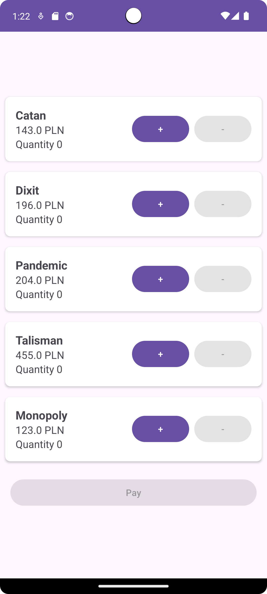
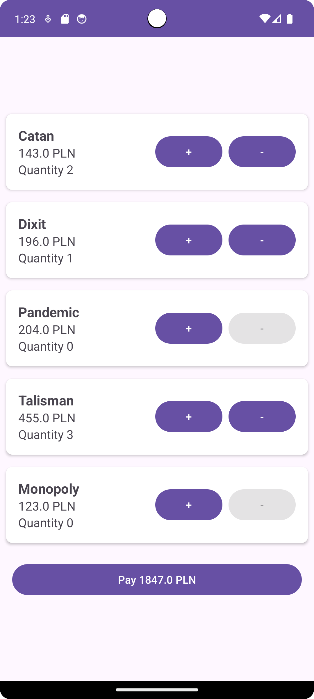
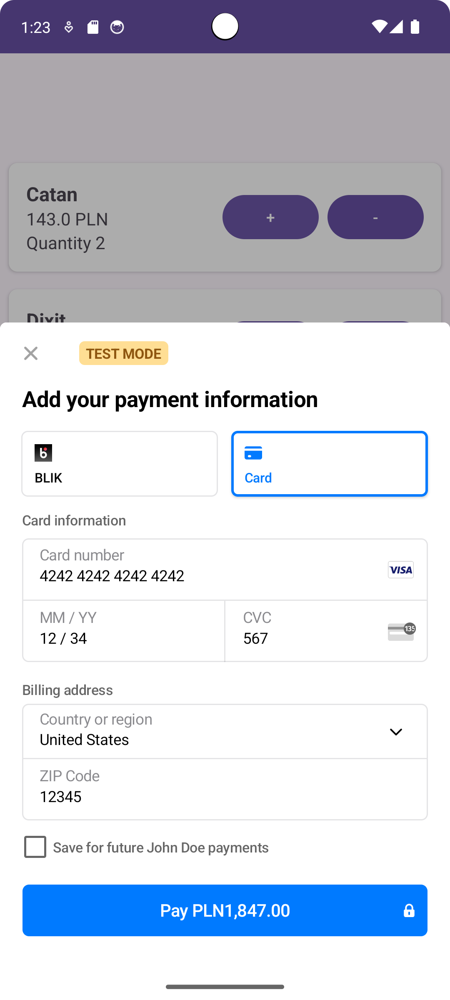
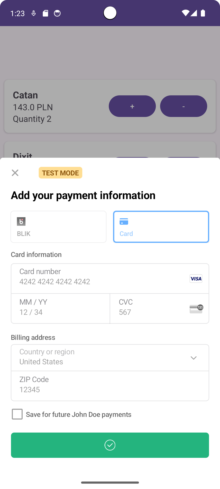
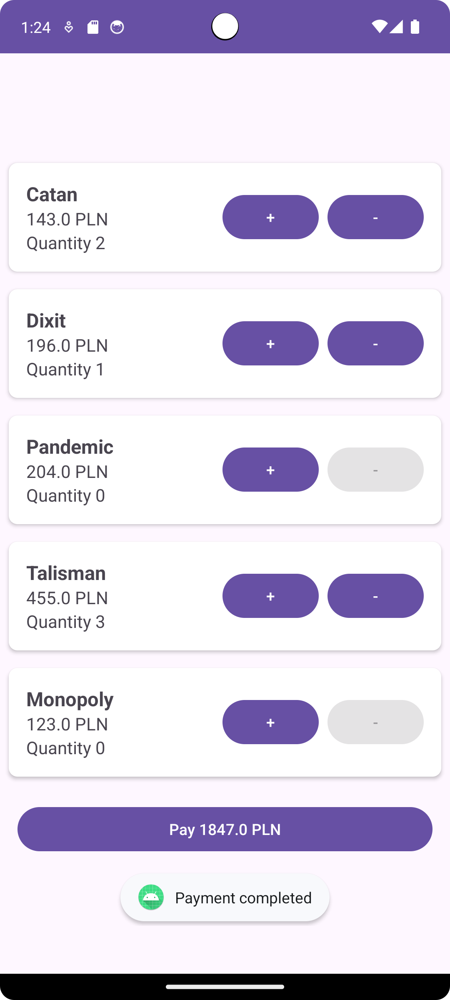

# Payments

## Requirements met

- 3.0 formularz płatności oraz mockowanie przez aplikację serwerową
  - Zaimplementowane z wykorzystaniem Stripe'a.
- 3.5 model płatności lokalnie
  - Zaimplementowany.
- 4.5 wdrożenie stripe'a
  - Zaimplementowane.

| 1                                    | 2                                    | 3                                    |
| ------------------------------------ | ------------------------------------ | ------------------------------------ |
|  |  |  |
| 4                                    | 5                                    |                                      |
|  |  |
