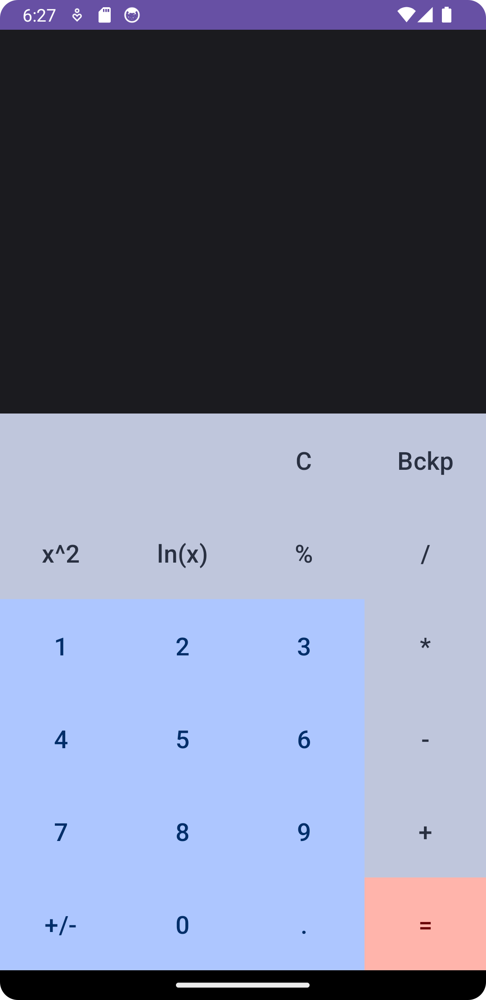
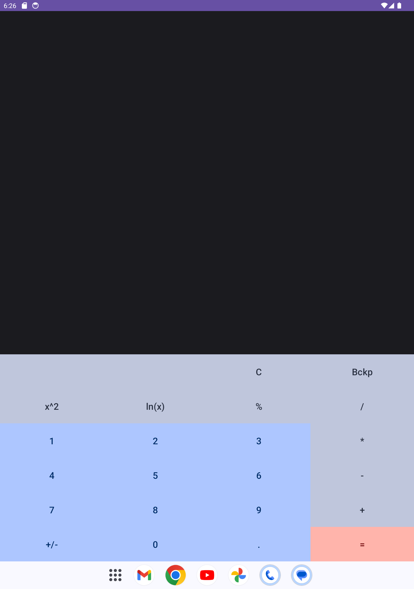
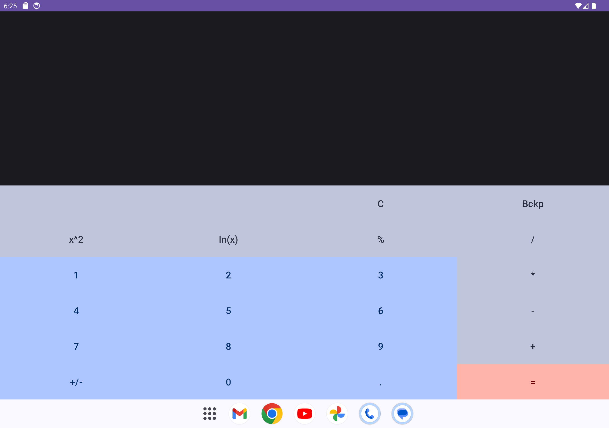

# Exercise 3 - Calculator

## Description

Android calculator app.

## Project notes

1. The calculator provides the following functions:
   - Addition
   - Subtraction
   - Multiplication
   - Division
   - Modulo
   - Power (x^2)
   - Natural logarithm (ln(x))
2. The calculator is responsive, meaning it work seamlessly on both phones and
   tablets.
3. Additional functionalities include the ability to:
   - Perform operations on the current result
   - Clear the result
   - Use the backspace for corrections

## Screenshots

### Phone

### Tablet Vertical

### Tablet Horizontal

