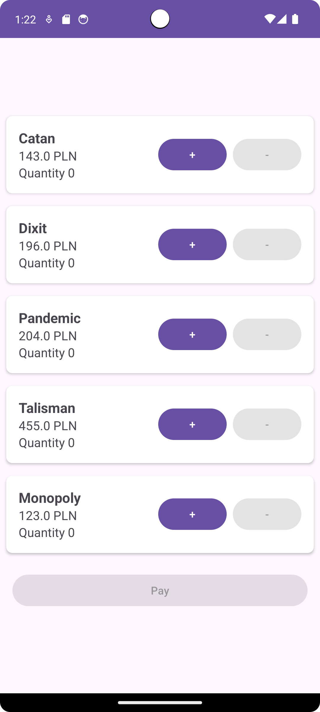
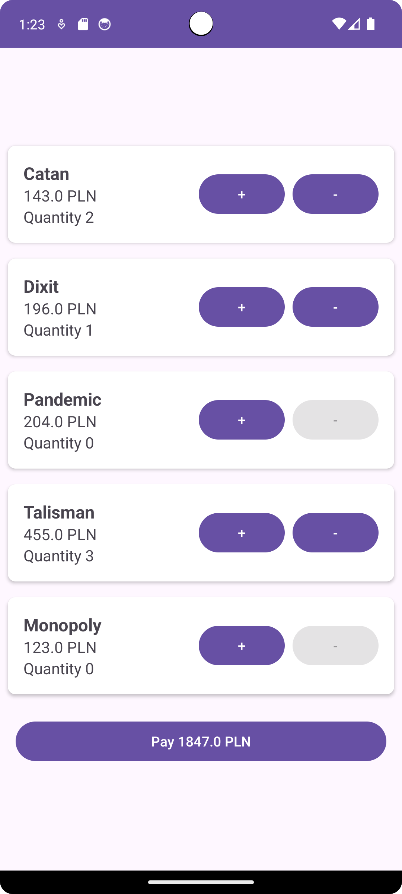
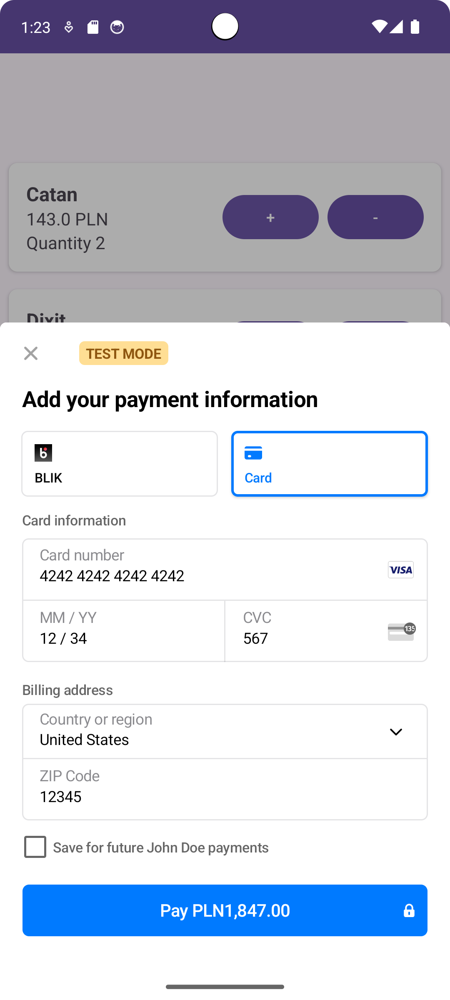
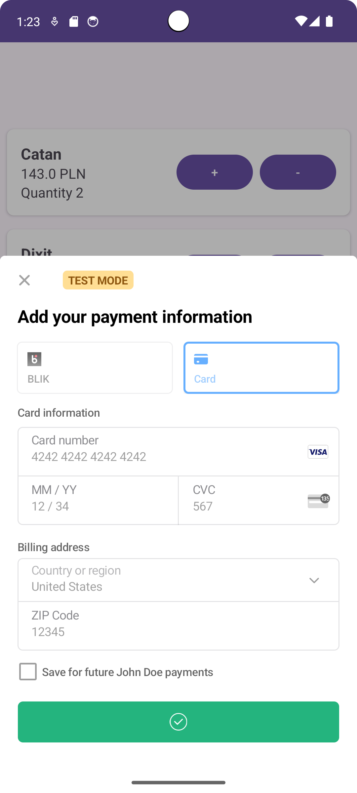
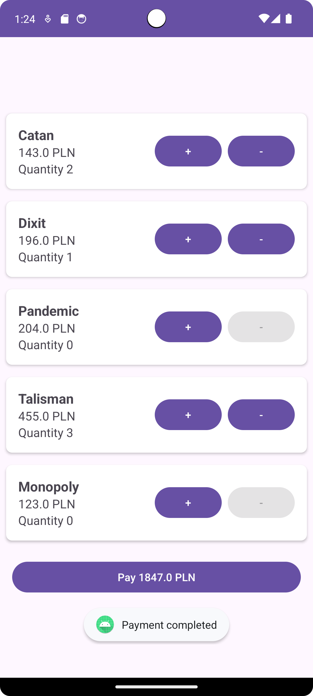

# Payments

## Requirements met

- 3.0 formularz płatności oraz mockowanie przez aplikację serwerową
  - Zaimplementowane z wykorzystaniem Stripe'a.
- 3.5 model płatności lokalnie
  - Zaimplementowany.
- 4.5 wdrożenie stripe'a
  - Zaimplementowane.

  
  
  
  
  

